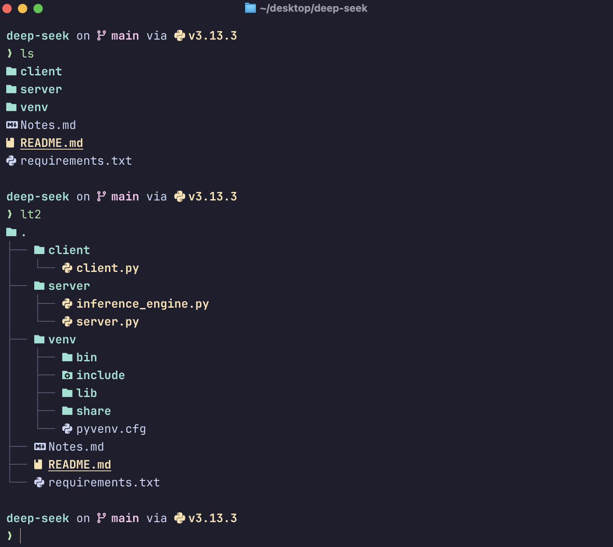
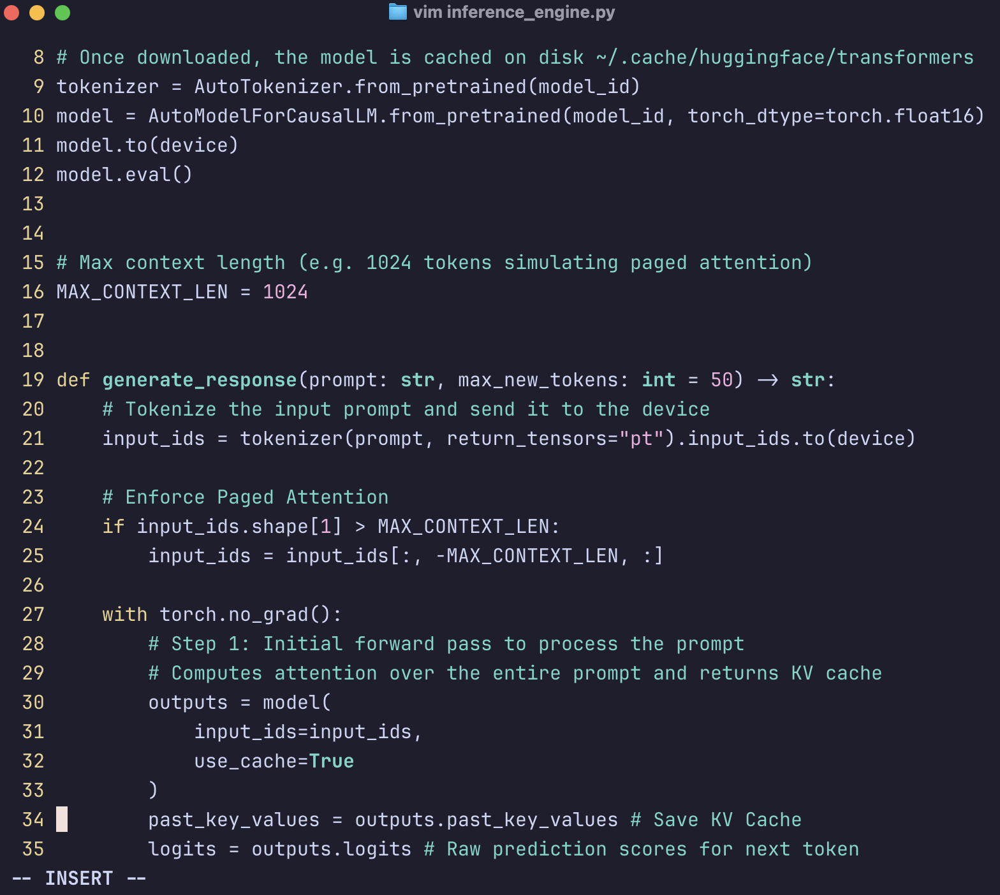

# 🛠️ Personal Configs
Personal setup for shell and terminal on Apple Silicon.

## 🔗 Essential Tools
- [Ghostty](https://ghostty.org/) – GPU-accelerated terminal emulator
- [Starship](https://starship.rs/) – Fast customizable shell prompt
- [Oh My Zsh](https://ohmyz.sh/) – Framework for managing your Zsh configuration
- [Eza](https://github.com/eza-community/eza) – Modern replacement for `ls`
- [Viu](https://github.com/atanunq/viu) - Simple terminal image viewer

[](snapshots/image1.png)





-----------

## 🚀 Getting Started on a Fresh Mac (Apple Silicon)

To replicate this terminal setup on a new Mac:

1. **Clone this repo**
```bash
git clone https://github.com/prashundey/personal-configs.git ~/personal-configs
```

2. **Copy configs to your root directory**
```bash
cp -r ~/personal-configs/.config ~/.config
cp ~/personal-configs/.zshrc ~/.zshrc
cp ~/personal-configs/.vimrc ~/.vimrc
```

3. **Install essential tools**

Homebrew
```bash
/bin/bash -c "$(curl -fsSL https://raw.githubusercontent.com/Homebrew/install/HEAD/install.sh)"
```

Install tools via Homebrew
```bash
brew install ghostty starship eza zsh viu neovim
```

Install Oh My Zsh
```bash
sh -c "$(curl -fsSL https://raw.githubusercontent.com/ohmyzsh/ohmyzsh/master/tools/install.sh)"
```

4. **Launch Ghostty**

> _Clean up the auto-created ghosty initial config file that was installed during the brew install_
```bash
rm -rf "$HOME/Library/Application Support/com.mitchellh.ghostty/config"
```

**Open Ghostty Terminal**

-------

## 🛠️ Quick Reference: Terminal Shortcuts and Aliases
Noting some upgraded or newly created shell commands

### 📁 Directory Listing with `eza` (modern `ls`)

These aliases enhance file listing with icons, headers, and structured tree views.

| Alias   | Description                                      |
|---------|--------------------------------------------------|
| `ls`    | Simple list, one item per line                   |
| `ll`    | Long listing with file size, owner, group        |
| `la`    | Long listing including hidden files              |
|   |           |
| `lt`    | Tree view of current directory                   |
| `lt1`   | Tree view up to 1 level deep                     |
| `lt2`   | Tree view up to 2 levels deep                    |
| `lt3`   | Tree view up to 3 levels deep                    |
|   |           |
| `lta`   | Tree view including hidden files                 |
| `lta1`  | Tree + hidden files, level 1 depth               |
| `lta2`  | Tree + hidden files, level 2 depth               |
| `lta3`  | Tree + hidden files, level 3 depth               |

All commands use `eza` with:

- `--icons` for file type symbols  
- `--header` for column labels  
- `--group-directories-first`  
- `--sort=name` for alphabetic order  


### 🖼️ Image Viewing in Terminal

| Alias   | Description                       |
|---------|-----------------------------------|
| `viu`   | View images inline in the terminal |

> _Requires a terminal with [Kitty graphics protocol](https://sw.kovidgoyal.net/kitty/graphics-protocol/) support — Ghostty supports this._


### 🧙 Ghostty Quick Toggle

Bring Ghostty to the front of the screen with a global shortcut:

- **Shortcut:** <kbd>⌘</kbd> + <kbd>⇧</kbd> + <kbd>Space</kbd>  
- This toggles the terminal like Spotlight, floating above other windows.
> _You can configure this binding in Ghostty’s config file”._


