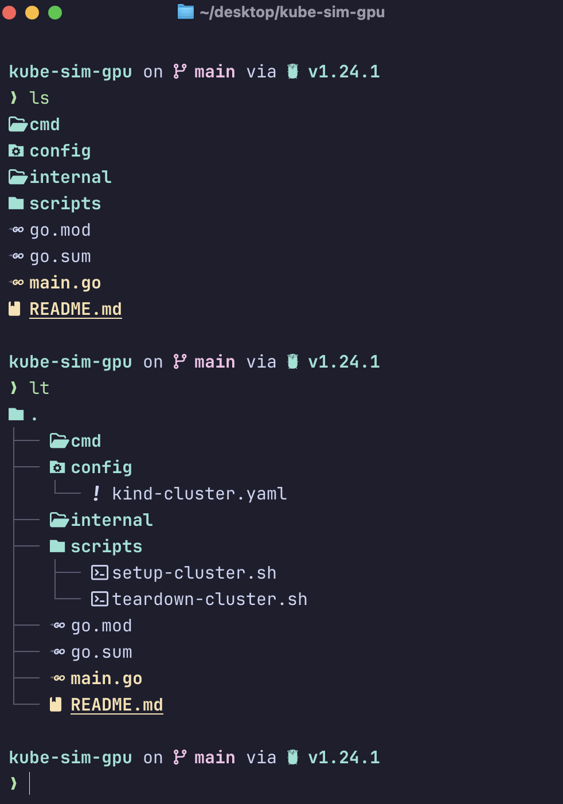

# 🛠️ Personal Configs
Personal setup for shell and terminal on Apple Silicon.

## 🔗 Essential Tools
- [Ghostty](https://ghostty.org/) – GPU-accelerated terminal emulator
- [Starship](https://starship.rs/) – Blazing-fast, customizable shell prompt
- [Oh My Zsh](https://ohmyz.sh/) – Framework for managing your Zsh configuration
- [Eza](https://github.com/eza-community/eza) – Modern replacement for `ls`

## ⚙️ Shell Setup – Zsh
- Using **Oh My Zsh** with a streamlined plugin setup
- Custom `eza` aliases for a cleaner `ls` experience:




-----------

## 🚀 Getting Started on a Fresh Mac (Apple Silicon)

To replicate this terminal setup on a new Mac:

1. Download Ghostty 
1. **Clone this repo**
```bash
git clone https://github.com/prashundey/personal-configs.git ~/personal-configs
```

2. **Copy configs to your root directory**
```bash
cp -r ~/personal-configs/.config ~/.config
cp ~/personal-configs/.zshrc ~/.zshrc
```

3. **Install essential tools**

Homebrew
```bash
/bin/bash -c "$(curl -fsSL https://raw.githubusercontent.com/Homebrew/install/HEAD/install.sh)"
```

Install tools via Homebrew
```bash
brew install ghostty starship eza zsh
```

Install Oh My Zsh
```bash
sh -c "$(curl -fsSL https://raw.githubusercontent.com/ohmyzsh/ohmyzsh/master/tools/install.sh)"
```

5. **Open Ghostty**
Clean up the auto-created ghosty initial config file that was installed during `brew install ghosty`
```bash
rm -rf "$HOME/Library/Application Support/com.mitchellh.ghostty/config"
```

**Open Ghostty Application**
